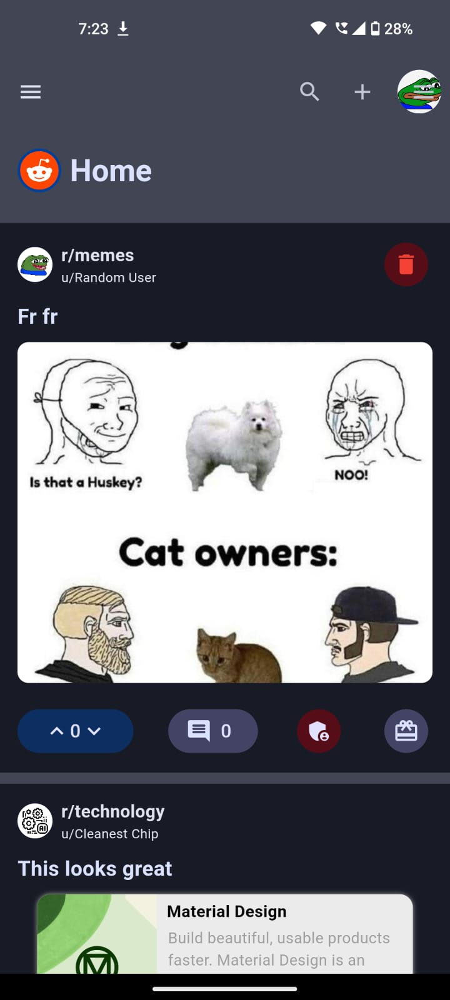
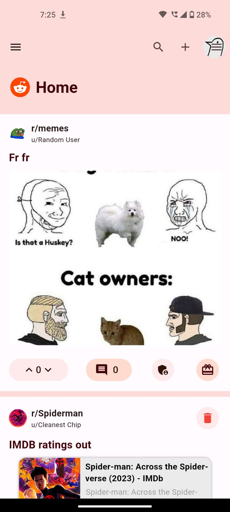
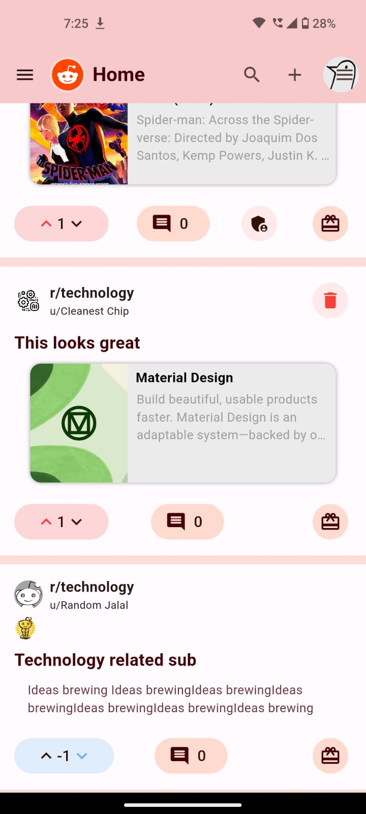
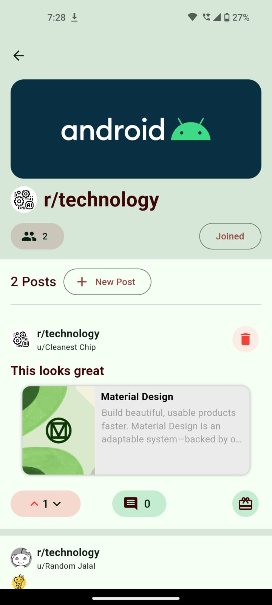
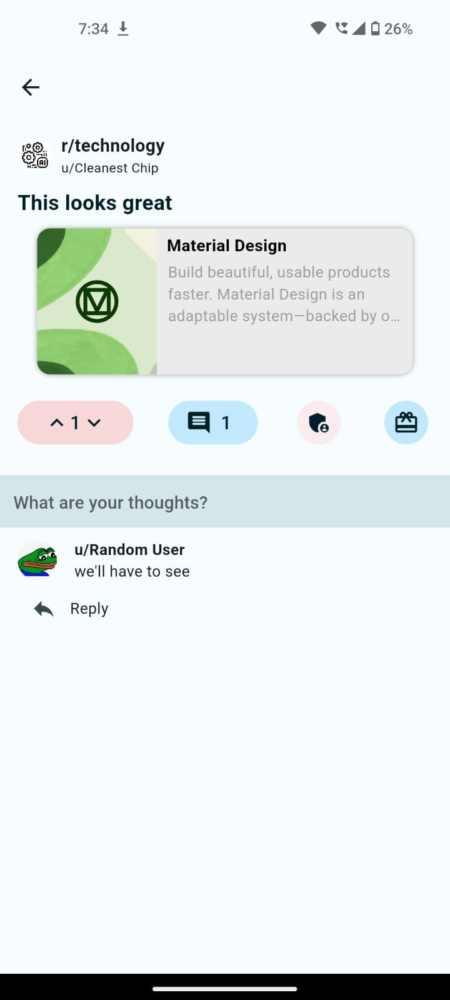
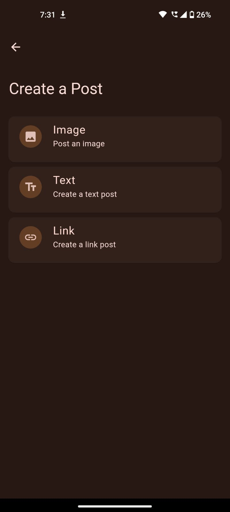
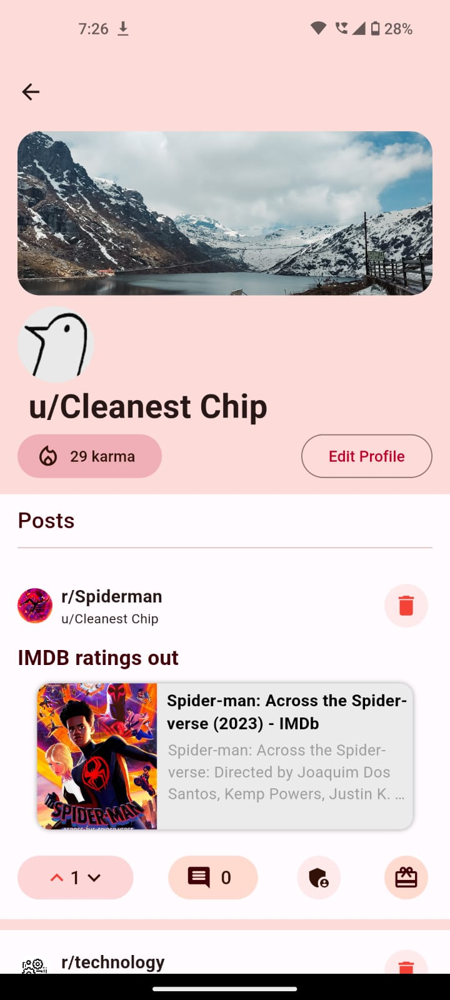

# Reddit-Clone

Reddit-Clone, a Flutter application that replicates reddit while following Material You. It utilizes Riverpod 2.0 for state management, Firebase for backend services and authentication/login.

- [Riverpod 2.0](https://riverpod.dev/): Riverpod is a simple yet powerful state management library for Flutter, designed to be easy to use and understand.

- [Firebase](https://firebase.google.com/): Firebase provides a comprehensive suite of backend services, including authentication and a real-time database, making it a perfect fit for building modern mobile and web applications.

## Features

- Material You design theme: Customizable and visually appealing user interface. [Learn more](https://material.io/design/material-you).
- Google/Guest Authentication: Authenticate via Google sign-in or as a guest.
- Create/Join Community (Subreddits): Create and join communities based on interests.
- Community Profile: Profile page for each community, including description and banner.
- Edit Description and Banner: Edit community description and banner image.
- Make New Posts: Create posts within joined communities.
- Display Posts from Joined Communities: Personalized feed showing posts from joined communities.
- Upvote and Downvote: Express opinions on posts through voting.
- Comments: Engage in discussions through comments.
- Awarding the Post: Acknowledge quality content by awarding posts.
- Karma System: Earn karma points based on activity and contributions.
- Adding Moderators: Assign moderators for community management.
- Delete Posts: Remove posts for content moderation or the posts you've made.
- User Profile: Show user activity, posts, and karma points.
- Edit User Profile: Customize user profile information.
- Browsing All Communities: Explore and discover various communities.

## Screenshots

    <br>
   

## Installation

After cloning this repository, navigate to the `flutter-reddit-clone` folder. Then, follow these steps:

1. Create a Firebase project.
2. Enable authentication methods such as Google Sign-In and Guest Sign-In.
3. Configure Firestore rules to secure your database.
4. Create Android and iOS apps in the Firebase project.
5. Use the FlutterFire CLI to add the Firebase project to this app.

Finally, run the following commands to start the app:

```bash
flutter pub get
open -a simulator
"# Reddit-clone" 

## Getting Started

This project is a starting point for a Flutter application.

A few resources to get you started if this is your first Flutter project:

- [Lab: Write your first Flutter app](https://docs.flutter.dev/get-started/codelab)
- [Cookbook: Useful Flutter samples](https://docs.flutter.dev/cookbook)

For help getting started with Flutter development, view the
[online documentation](https://docs.flutter.dev/), which offers tutorials,
samples, guidance on mobile development, and a full API reference.
"# Reddit-Clone"

Feel free to explore and modify this project to fit your specific needs and requirements. Happy coding!